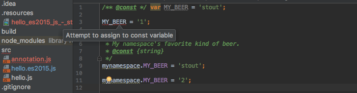

# study-closure-compiler

## Getting Started

[Getting Started with the Closure Compiler Application](https://developers.google.com/closure/compiler/docs/gettingstarted_app)

```
$ npm install --save google-closure-compiler
```

```$xslt
$ java -jar node_modules/google-closure-compiler/compiler.jar --help
```

```$xslt
$ java -jar node_modules/google-closure-compiler/compiler.jar --js src/hello.js --js_output_file build/hello-compiled.js
```

### ES2015

Transpiling ES2015 to ES5

```$xslt
const hello = (longName) => {
  alert('Hello, ' + longName);
};
hello('New User');
```

```$xslt
$ java -jar node_modules/google-closure-compiler/compiler.jar --js src/hello.es2015.js --js_output_file build/hello-compiled.js
```

```$xslt
var hello=function(a){alert("Hello, "+a)};hello("New User");
```

## Annotating JavaScript for the Closure Compiler 

### Simple const check

[Annotating JavaScript for the Closure Compiler](https://github.com/google/closure-compiler/wiki/Annotating-JavaScript-for-the-Closure-Compiler)

```$xslt
/** @const */ var MY_BEER = 'stout';
MY_BEER = '1';

/**
 * My namespace's favorite kind of beer.
 * @const {string}
 */
mynamespace.MY_BEER = 'stout';
mynamespace.MY_BEER = '2';
```

```$xslt
$ java -jar node_modules/google-closure-compiler/compiler.jar --js src/annotation.js --checks_only
src/annotation.js:3: WARNING - constant MY_BEER assigned a value more than once.
Original definition at src/annotation.js:1
MY_BEER = '1';
^^^^^^^^^^^^^

0 error(s), 1 warning(s)
```

It looks working, but `mynamespace.MY_BEER = '2';` has no alert.. and it's same to IntelliJ.



### Type check

Option `--new_type_inf` would be needed.

#### Function parameter's types

```$xslt
/**
 * @param a {number}
 * @param b {number}
 * @returns {number}
 */
function foo(a, b) {
  return a - b + 1;
}
```

```$xslt
$ java -jar node_modules/google-closure-compiler/compiler.jar --js src/annotation.js --checks_only --new_type_inf
src/annotation.js:28: WARNING - Invalid type for parameter 1 of function foo.
Expected : number
Found    : string

foo('aaa', 'bbb');
    ^^^^^

src/annotation.js:28: WARNING - Invalid type for parameter 2 of function foo.
Expected : number
Found    : string

foo('aaa', 'bbb');
           ^^^^^

0 error(s), 2 warning(s), 77.7% typed
```

#### Function parameter's types (object type)

```$xslt
/**
 * @param {{firstName: string, lastName: string}} props
 * @returns {string}
 */
function func1 (props) {
  return `${props.firstName} ${props.lastName}`;
}

func1({
  firstName: 'first_name 1',
  familyName: 'family_name 1',
});
```

```$xslt
$ java -jar node_modules/google-closure-compiler/compiler.jar --js src/annotation.js --checks_only --new_type_inf
src/annotation.js:38: WARNING - Invalid type for parameter 1 of function func1.
Expected : {firstName:string, lastName:string}
Found    : {familyName:string, firstName:string}
More details:
The found type is missing property lastName
func1({
      ^

0 error(s), 1 warning(s), 100.0% typed
```

